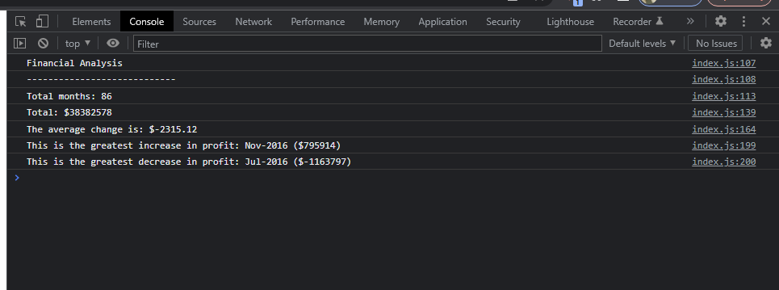

# <Console-Finances>

## Description

This project was my first delve into Javascript, and a bit of a challenge for me. The initial project files contained a data set which held profits and losses from  month to month within a nested array. The aim of the project was to use javascript to print the results of equations to the console on the live site and show the number of overall months included, overall profit, the average of changes month on month, the greatest increase in profits, and the greatest decrease in profits.

This project was intended as my first step into javascript, and I did find it difficult, with this being the first programming language of this sort that I've ever used. I utilised a lot of Stack Overflow forums to help guide my solutions, but moving forward I hope to come to better understand how to write javascript code from scratch, and this project has helped me to touch the surface of this.

## Installation and Usage

The project can be visited via the following url: https://emh93.github.io/Console-Finances/ 

Once on the page, you can view the results of the project by inspecting the page with developer tools (using Chrome) via: More tools > Developer Tools, or hitting Ctrl + shift + i, then opening the console. You can see a screenshot of the results of the code in the console below:

## Credits

Solutions crafted using multiple sources on Stack Overflow: 
https://stackoverflow.com/ 
https://stackoverflow.com/questions/9329446/loop-over-an-array-in-javascript 

## License

MIT license
